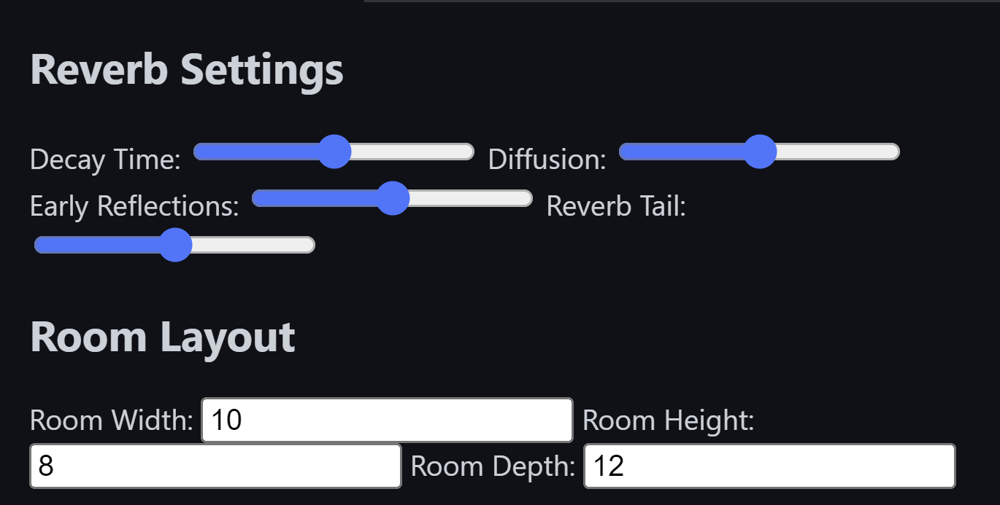

# Room *emulator/reverb (80s digital)

##
Input/output: The user interface of the old school Simulator typically has an input section where you can select the audio file you want to process, and an output section where you can preview the processed sound.

Reverb settings: The main purpose is to simulate various room acoustics. One can adjust the reverb settings of the simulator to change the size, shape, and overall character of the virtual space. Some of the parameters you may encounter include decay time, diffusion, early reflections, and reverb tail.

Room layout: You can also adjust the dimensions and layout of the virtual room, including the shape, size, and position of the walls, ceiling, and floor. These settings can affect the sound propagation and create different acoustic effects.

Frequency response: The Simulator may also have controls for adjusting the frequency response of the reverb, allowing one to emphasize or attenuate certain frequency ranges.

Presets: To simplify the process of finding the desired sound, the user interface may offer presets for different room sizes and acoustic characteristics. One can also create and save own presets for future use.

Metering: The user interface may include visual feedback in the form of metering, displaying the input and output levels, the frequency spectrum, and other relevant parameters.

Routing: The emulator can be used as a standalone application or as a plugin within a digital audio workstation (DAW). In the latter case, the user interface may include routing controls for sending and receiving audio signals to and from the DAW.